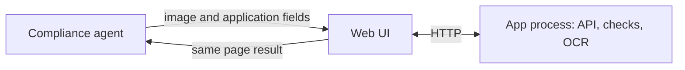
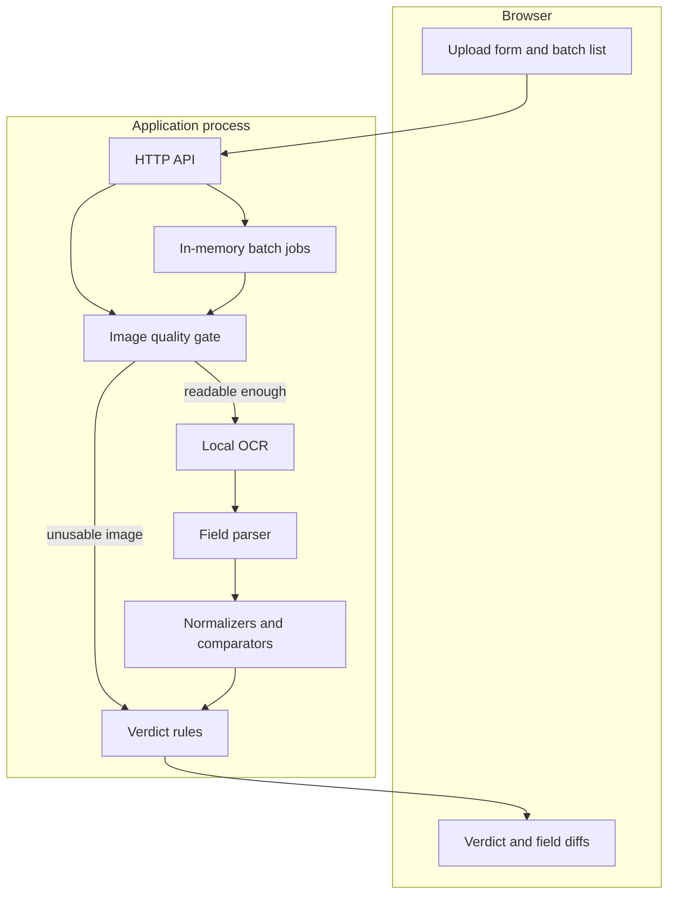
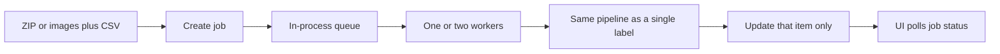

# System Design
# AI-Powered Alcohol Label Verification App (Prototype)

**Source:** `SOFTWARE_REQUIREMENTS.md` and discovery notes in `README.md`  
**Scope:** Standalone proof-of-concept. How the prototype is built and how verdicts are decided.  
**Priority:** A correct, fast core over a complete compliance engine.

---

## 1. Approach

The prototype does two jobs, in order:

1. **Read** the label with a small OCR model running in the same process as the app.
2. **Compare** the extracted fields to the application values with per-field rules.

No cloud vision API is on the request path. Google Cloud Vision, Amazon Rekognition, Amazon Textract, and Azure AI Document Intelligence are out. The model weights ship inside the application image, so a later deploy behind TTB’s restricted outbound firewall still runs.

OCR output is never trusted on its own. Each field gets a status from two signals: how sure the reader was, and how the text compares after normalization. The screen shows three label verdicts:

| Verdict | Meaning for the agent |
|---|---|
| **Pass** | Every required field was read clearly and matches its rule. |
| **Fail** | At least one field was read clearly and breaks its rule. |
| **Needs review** | The system is not sure enough to pass or fail. A person decides, or a clearer image is needed. |

A blurry or unreadable photo is **Needs review**, not a compliance failure. The label may be fine; the picture is the problem. Agents already ask for a new image when they cannot read one (discovery notes). The tool should say that in plain language and leave the judgment with the agent.

---

## 2. Design Goals

| ID | Goal | Tied to |
|---|---|---|
| SD-1 | Single-label result on screen in about 5 seconds. | NFR-1 |
| SD-2 | One primary path: add image and application data, press Verify, read the result on the same page. | FR-15, NFR-2 |
| SD-3 | Inference runs locally. Runtime does not call an external ML endpoint. | NFR-3 |
| SD-4 | Images and application fields exist only while a check is in progress. | NFR-4 |
| SD-5 | One bad item in a batch does not stop the rest. | NFR-6 |
| SD-6 | Unreadable text is never treated as a match. | FR-8, FR-13 |
| SD-7 | Case and styling differences match. Wording differences do not auto-match. | FR-9, FR-11 |

---

## 3. System Context



The agent is the human verifier. There is no second review queue, no assignment workflow, and no write-back to COLA. **Needs review** means this result is flagged on the page the agent is already looking at, with the field, the extracted text, and a short reason.

Application data is typed into the form or uploaded as a CSV because COLA is not connected.

---

## 4. Architecture

One deployable process. The UI, the check pipeline, and OCR live together so the prototype stays easy to run and has no hidden network hop.



| Piece | Responsibility |
|---|---|
| Web UI | One screen for a single label. A second view for batch progress, summary counts, and per-item field diffs. Large labeled controls. Status shown as text plus color. |
| HTTP API | `POST /verify` for one label, synchronous. Batch create, status, and item detail for 200–300 items. |
| Image quality gate | Rejects files the reader should not guess on: too small, too blurry, blank, or mostly glare. |
| Local OCR | Detects text lines, reads them, returns each line’s text, bounding box, and confidence. |
| Field parser | Assigns lines to brand, class/type, alcohol, net contents, warning, bottler, and origin. |
| Comparators | Apply the field rules in section 7. |
| Verdict rules | Turn field statuses into Pass, Fail, or Needs review. |
| Batch jobs | Hold progress in memory until the job expires. A failed item is recorded; the loop continues. |

Suggested module split, so the rules stay testable without a model loaded:

- `quality` — blur, size, blank/glare checks
- `ocr` — the only module that imports the OCR runtime
- `parse` — line assignment
- `normalize` and `compare` — pure functions, covered by unit tests
- `decide` — overall verdict
- `jobs` — batch state and expiry

---

## 5. Single-Label Pipeline

`POST /verify` runs the steps below in one request. The browser waits. Target budget is in section 12.

1. **Accept the file.** JPEG, PNG, WEBP, or TIFF. Size cap 10 MB. Anything else returns a plain-language error and does not start OCR.
2. **Orient and scale.** Apply EXIF rotation. Score image quality on a small grayscale copy. Run OCR on a copy whose long edge is at most 1600 px so CPU time stays predictable.
3. **Quality gate.** If the image is unusable, skip OCR and return **Needs review** for the label, **Unreadable** for every field, and a recovery sentence: upload a sharper photo or review it by eye. Skipping OCR here also avoids a false Fail caused by empty text.
4. **OCR.** Collect lines in reading order with boxes and confidences.
5. **Parse.** Pull the seven fields. A missing field stays missing.
6. **Compare.** Normalize where the rules allow, then mark each field.
7. **Decide.** Aggregate to Pass, Fail, or Needs review.
8. **Respond and discard.** Return the payload below. Delete the temp file. Do not write the image or the application fields to a database.

A label may include a front and a back (the warning is often on the back). One application accepts one or more images. OCR runs on each image, lines are pooled, and field assignment uses the pool. The 5-second budget assumes one image; each extra image is allowed to add time, and the UI should say so.

### 5.1 Result shape

```json
{
  "overall": "needs_review",
  "summary": "Alcohol content could not be read. The other fields match.",
  "fields": [
    {
      "name": "brand_name",
      "application": "Stone's Throw",
      "extracted": "STONE'S THROW",
      "status": "match",
      "confidence": 0.93,
      "reason": "Same name after ignoring case."
    }
  ],
  "transcript": ["STONE'S THROW", "Kentucky Straight Bourbon Whiskey"],
  "image": { "readable": true, "notes": [] }
}
```

`transcript` is the raw lines, shown on the detail view so an agent can see what the reader saw when the verdict is Needs review.

Field status is one of: **Match**, **Mismatch**, **Unreadable**, **Needs review**.

---

## 6. Unreadable Images and Low Confidence

This is the rule that keeps a bad photo from looking like a bad label.

### 6.1 Two different problems

| Situation | What the agent should conclude | System result |
|---|---|---|
| The photo is too blurry, tiny, blank, or washed out by glare to read at all. | “I need a better image, or I will read this one myself.” | **Needs review.** Fields are **Unreadable**. Reason names the image problem. OCR is skipped. |
| The photo is usable, but one field is missing, cut off, or low confidence. | “The rest may be checkable. This field needs my eyes.” | That field is **Unreadable** or **Needs review**. It is never **Match**. |
| A field was read clearly and disagrees with the application. | “This looks like a real mismatch.” | That field is **Mismatch**. Overall can be **Fail**. |
| Text is close but not the same, or confidence is only moderate. | “This might be a misread or a real wording change.” | That field is **Needs review**. |

FR-5’s “fail clearly” means the *read* fails in plain language, with a next step. It does not mean the label fails compliance. FR-13 already names Needs review for unreadable or ambiguous cases. Those two requirements meet in this table.

### 6.2 Image quality gate

Run these checks before OCR, on a grayscale image resized to a fixed width so the cutoffs stay stable:

| Check | Starting cutoff | If tripped |
|---|---|---|
| Short edge of the original | Under 600 px | Needs review, note “too small” |
| Blur (variance of the Laplacian) | Under 100 on the resized grayscale | Needs review, note “too blurry” |
| Blank or glare | Most pixels near white or near a single bright band | Needs review, note “unreadable lighting” |

Cutoffs live in config and get tuned on fixture images, including a deliberately blurry copy of the bourbon label. They are starting points, not a claim about every phone camera.

A stretch goal (P2) is a light deskew for angled photos. If deskew is uncertain, keep the original and let the verdict fall through to Needs review. Do not spend the 5-second budget on a heavy restoration model.

### 6.3 How confidence and comparison combine

OCR returns a 0–1 score per line. A field’s score is the **lowest** line score among the lines that formed it. That is conservative: one bad line keeps the field out of Fail and out of a careless Pass.

The application value is a second source. If the read text normalizes to exactly that value, a moderate score is enough to match, because a blurry misread is unlikely to spell the applicant’s brand by accident. If it does not match, a moderate score means “we might have misread,” which is review, not failure.

| Field score | Comparison | Field status |
|---|---|---|
| High, at or above 0.85 | Normalized match | Match |
| High | Clearly different | Mismatch |
| High | Near miss (section 7) | Needs review |
| Medium, 0.60 up to 0.85 | Normalized match | Match |
| Medium | Near miss or clearly different | Needs review |
| Low, under 0.60 | Anything, including a lucky match | Unreadable |
| No line found | — | Unreadable |

Starting cutoffs: high ≥ 0.85, low < 0.60. Tune them so the bourbon fixture passes and the blurry fixture comes back Needs review.

### 6.4 Overall verdict

Apply in this order:

1. Image gate failed → **Needs review**. Stop.
2. Any required field is a confident **Mismatch** → **Fail**. Other fields still show their own status, including Unreadable.
3. Any required field is **Unreadable** or **Needs review** → **Needs review**.
4. Otherwise → **Pass**.

A clear brand mismatch stays a Fail even if alcohol content is unreadable. A label whose only problem is blur stays Needs review, so agents do not learn to ignore Fail.

Required fields: brand name, class/type, alcohol content, net contents, government warning.  
Optional fields: bottler/producer, country of origin. If both sides omit an optional field, it is not shown as a failure. If the application has it and the label read is unreadable, that field is Needs review and step 3 applies.

---

## 7. Normalization and Comparison

Normalization answers the Stone’s Throw case. It does not fuzzy-match different words into a Pass.

### 7.1 Stone’s Throw

`STONE'S THROW` and `Stone's Throw` are the same brand after a case fold. That is the whole example from the discovery notes, and normalization handles it.

Brand normalization, applied to both sides before compare:

1. Unicode NFKC, so full-width and compatibility characters collapse.
2. Case fold.
3. Map apostrophe and prime variants (`'`, `'`, `′`, `` ` ``) to `'`.
4. Map hyphen variants to `-`.
5. Drop trademark marks `®` and `™`.
6. Collapse whitespace and trim.
7. Remove zero-width characters.

After that, `STONE'S THROW` equals `Stone's Throw`. The reason string should say so: “Same name after ignoring case.”

What normalization must not do:

| Pair | Result | Why |
|---|---|---|
| `Stone's Throw` vs `Stone's Throw` after case fold | Match | FR-9, styling only |
| `Stones Throw` vs `Stone's Throw` | Needs review | The apostrophe is missing. Close, but it is a wording change. |
| `Stone Throw` vs `Stone's Throw` | Needs review if the edit distance is small; Mismatch if the read is high confidence and the strings are farther apart | Not an automatic Pass |
| `Stone's Throw` vs `River's Edge` | Mismatch when the read is high confidence | Genuine wording difference |

Near miss means: not equal after normalization, and either the edit distance is 2 or less or the character similarity is at least 0.90. Near misses are **Needs review**, never **Match**. Fuzzy scores are a routing tool for the agent, not a second definition of equality.

Class/type, bottler, and origin use the same string normalization (case, whitespace, punctuation, apostrophes). Wording that still differs is a Mismatch at high confidence, and a Needs review when the field score is only medium or the strings are a near miss. A one-character OCR slip such as `Whlskey` should not become a hard Fail.

### 7.2 Alcohol content

Parse numbers out of both strings. Do not require the surrounding words to match.

- Recognize `45%`, `45 % alc/vol`, `45% ABV`, and `90 proof`.
- US proof used by TTB: proof = 2 × ABV. So `90 proof` and `45%` match. `45% Alc./Vol. (90 Proof)` matches an application value of `45%` or `90 proof`.
- A numeric disagreement at high confidence is a Mismatch (`45%` vs `40%`).
- The same disagreement at medium confidence is Needs review, because `45` misread as `40` is a common OCR slip.
- Unparseable text is Unreadable.

### 7.3 Net contents

Parse a quantity and a unit.

- `750 mL`, `750ml`, and `750 ML` match.
- `750 mL` and `0.75 L` match.
- Fluid ounces are converted at 29.5735 mL per fl oz, with a 0.5% tolerance.
- A real quantity difference at high confidence is a Mismatch.

### 7.4 Government warning

The warning is the exception to fuzzy thinking. Comparison is against the application value when the agent supplied one, and always against the statutory text in section 9 when they did not. Case is significant. The steps in section 7.1 are not applied.

The only whitespace allowance is layout, not wording: OCR wraps the paragraph, so line breaks inside the warning are joined with a single space, and repeated spaces collapse. Punctuation stays. `Government Warning` in title case is a Mismatch when the read is high confidence. That is the case Jenny described.

Warning text at medium confidence that is not exact is Needs review, not Fail. Low confidence is Unreadable.

---

## 8. Field Parser

OCR returns lines, not form fields. Assignment is by anchors, then by what is left. This stays a set of rules, not a beverage-type regulation engine.

| Order | Field | How a line is claimed |
|---|---|---|
| 1 | Government warning | A line containing `GOVERNMENT WARNING`, plus the following lines through the end of the statutory sentence. |
| 2 | Alcohol content | A line matching a percent or proof pattern. |
| 3 | Net contents | A line matching a volume pattern (`mL`, `L`, `fl oz`). |
| 4 | Country of origin | A line with `Product of` or `Produced in`, when present. |
| 5 | Bottler / producer | A line with `Bottled by`, `Distilled by`, `Produced by`, or `Imported by`, when present. |
| 6 | Class / type | A line containing a class word (bourbon, whiskey, vodka, gin, rum, tequila, brandy, wine, beer, ale, and close variants) that was not already claimed. |
| 7 | Brand name | The tallest remaining line, preferring the upper part of the label. `OLD TOM DISTILLERY` falls out here on the sample. |

Claimed lines are removed from the pool so the brand step does not swallow the warning. If two lines could be the brand, take the taller one and mark brand **Needs review** when the runner-up is close in height. Ambiguous assignment is review, not a silent pick.

The class-word list is only a locator. The comparator still compares that line’s wording to the application value.

---

## 9. Government Warning Checks

Canonical text (27 CFR 16.21), from the requirements doc:

> **GOVERNMENT WARNING:** (1) According to the Surgeon General, women should not drink alcoholic beverages during pregnancy because of the risk of birth defects. (2) Consumption of alcoholic beverages impairs your ability to drive a car or operate machinery, and may cause health problems.

Three checks:

| Check | P0 behavior | Later behavior |
|---|---|---|
| Prefix is exactly `GOVERNMENT WARNING:` | High-confidence miss → Mismatch. | Same. |
| Body matches the statutory sentences after join-and-collapse of line breaks | High-confidence miss → Mismatch. | Same. |
| Prefix is bold and the body is not, when the image can show emphasis | Not checked. The UI says “Bold was not checked.” This does not block a Pass. | P2. See below. |

P2 emphasis check, still fully local:

- Use the OCR boxes to crop the prefix and a sample of the body.
- Compare stroke thickness (or foreground pixel density) of the prefix crop to the body crop.
- Prefix clearly heavier than the body → emphasis Match.
- Body as heavy as the prefix, or prefix clearly not heavy → emphasis Mismatch.
- Crop too small, low contrast, or overlapping text → **inconclusive**.

An inconclusive emphasis check forces overall **Needs review** even when the words match. A wrong guess about bold is worse than sending the label to the agent. Emphasis is out of the P0 latency path.

Choose an OCR build that preserves case. If a fixture shows the engine lowercasing the prefix, that check is treated as inconclusive rather than as an automatic Fail.

---

## 10. Batch Processing

Single-label stays synchronous. Batch does not. A 200–300 item run must not hold one HTTP request open or freeze the page (NFR-6, FR-16).



- Input is a CSV of application rows plus images (a multi-file upload or a zip). CSV columns: image file name, brand, class/type, alcohol, net contents, warning, bottler, origin. Warning may be blank; a blank cell means “compare to the statutory text.”
- The server stores the job in memory under a random id. Suggested lifetime: 60 minutes, then files and rows are deleted.
- Workers run the section 5 pipeline per item with a concurrency of 2, so a batch cannot starve the machine the interactive check runs on.
- Item states: Queued, Running, Pass, Fail, Needs review, Error.
- A corrupt file, a missing image name, or a timeout becomes **Error** on that row with a plain-language reason. The next row still runs.
- Summary counts are pass / fail / needs review / error.
- Opening a row shows the same field payload as a single-label result (FR-17).

Error and Needs review are different. Error means this item never produced a label verdict (bad file, timeout, missing CSV fields). Needs review means the pipeline ran and a person should look.

Zip uploads are checked for path traversal and for a compressed-size limit before extract. Cap the batch at 300 items.

---

## 11. Self-Hosting and Deployment

### 11.1 Recommendation

Use **RapidOCR on ONNX Runtime** with the **PP-OCRv4 or PP-OCRv5 mobile** detection and recognition models (PaddleOCR weights, converted to ONNX).

Why this and not a hosted API:

- Weights load from disk inside the app process. A verify call makes no outbound request.
- The mobile models are the “small OCR” path and are the ones that can hit the 5-second target on CPU.
- Each line comes back with a box and a confidence, which sections 6 and 9 need.
- Case is preserved, which the warning prefix needs.
- The Python dependency is ONNX Runtime, which is lighter than shipping the full PaddlePaddle stack.

Pin the model files by version in the image build. The container build is allowed to download them. The running container is not.

If the mobile model cannot read the bourbon fixture reliably, switch the recognition model to the larger server model behind a config flag and measure again. Accuracy does not get to break the 5-second target; if the server model is too slow, stay on mobile and send the hard photos to Needs review.

### 11.2 Options considered

| Option | Role |
|---|---|
| RapidOCR + PP-OCR mobile, ONNX | **Default.** Local, fast enough, boxes and confidence, case preserved. |
| Full PaddleOCR runtime, same weights | Fallback only if ONNX cannot do something the pipeline needs. Heavier image. |
| Tesseract 5 | Reasonable for clean flat scans. Weak on bottle photos, glare, and rotation. Not the default. |
| EasyOCR | Torch install is large, and CPU latency often misses a 5-second budget. |
| A local vision-language model | Can name fields, but it is slow on CPU, confidence is poorly calibrated, and it fights SD-1. Out of scope. |
| Cloud OCR (Vision, Rekognition, Textract, Azure Document Intelligence) | Excluded. A future TTB firewall would block these, and the prototype is not allowed to depend on them. |

### 11.3 Runtime shape

- One container: web UI, API, pipeline, and model files under something like `/opt/models`.
- Local run: `docker compose up`.
- Public prototype: any host that runs a container. Azure Container Apps is a natural fit for TTB’s Azure estate, and it does not require Azure AI services.
- Suggested size for the 5-second target: 2 vCPU, 4 GB RAM. Measure with the bourbon fixture before calling the budget met.
- Batch concurrency stays at 2 on that size.

Future TTB hosting uses the same image. Document the dependency as “none at request time.” There is no degraded cloud mode, because there is no cloud model in the design.

### 11.4 Request guards

Prototype scope still includes basic abuse limits so a public URL stays up:

- Allowlist of image types and a 10 MB cap.
- Batch cap of 300.
- Request timeout around 15 seconds for a single label, after which the user gets a recoverable timeout message. The happy path is still aimed at 5 seconds.
- Temp files removed in a `finally` block.

---

## 12. Latency Budget

Single label, one image, warm process (model already loaded). Cold start is excluded from the 5-second user budget; the process loads models at startup.

| Stage | Target |
|---|---|
| Upload, decode, EXIF, scale | 0.3 s |
| Quality gate | 0.1 s |
| OCR | 3.0 s |
| Parse, compare, decide | 0.1 s |
| Response | 0.2 s |
| **Total** | **under 5 s** |

If OCR exceeds 3 seconds on the fixture, reduce the long-edge cap before adding hardware. Log stage timings on each request so the budget is visible while tuning. Do not log label text or application values.

---

## 13. Data Handling

- Single-label bytes live for the request, then the temp file is deleted.
- Batch bytes live in the job’s temp directory until the job expires or the process restarts.
- No user accounts, no database of applications, no write to COLA.
- Logs carry a job id and stage timings only.

A process restart clears in-memory jobs. That is acceptable for a prototype. A durable queue is out of scope.

---

## 14. Errors

Every failure the agent can hit has a sentence and a next step (FR-18).

| Case | What we say | Item state |
|---|---|---|
| Unsupported or corrupt file | “This file is not a readable image. Use a JPEG or PNG.” | Error |
| Missing application fields | “Brand, class, alcohol content, and net contents are required before verification.” | Error |
| Image too blurry, small, or glaring | “This image is too blurry to read. Upload a sharper photo, or review the label yourself.” | Needs review |
| Field unreadable | “Alcohol content could not be read on this label.” | Needs review |
| Timeout | “Verification took too long. Try again, or use a smaller image.” | Error |
| One batch row fails | That row shows the error. The summary keeps counting the others. | Error on that row |

---

## 15. Decisions and Trade-offs

| Decision | Choice | Trade-off |
|---|---|---|
| Reader | Small local OCR model, not a cloud API and not a vision-language model | Weaker on exotic layouts; fast, offline, and confidence scores are usable. |
| Unreadable image | Needs review, with a request for a better photo | Agents still look at some items. They are not told a good label failed. |
| Low confidence plus disagreement | Needs review, not Fail | Fewer false failures. Fail stays meaningful. |
| Moderate confidence plus exact normalized match | Match | Uses the application value as corroboration so minor noise does not flood the queue. |
| Brand equality | Normalize case, apostrophes, whitespace, trademarks | Solves Stone’s Throw. Does not auto-pass different words. |
| Near misses | Always Needs review | An extra human look on `Stones Throw` vs `Stone's Throw`, which is the right call. |
| Warning whitespace | Join wrapped lines only | Real labels wrap. Wording and case still have to match. |
| Bold warning | P2, and inconclusive means Needs review | P0 ships without a bold guess. |
| Batch | In-memory jobs, concurrency 2 | Simple and forgetful. A restart drops the batch. Fine for the prototype. |
| Field location | Anchors and text height | Works on the bourbon-style sample. Odd layouts become Needs review instead of a wrong Pass. |
| Proof math | US rule, proof = 2 × ABV | Correct for TTB spirits. Not a general alcohol-science module. |

---

## 16. Out of Scope

- COLA integration, accounts, and storing applications.
- A separate human-review product. The agent and the Needs review row are the review path.
- A full beer/wine/spirits rule engine. Class words are locators only.
- Cloud OCR and any runtime call to a third-party model API.
- Heavy image restoration for glare and extreme angles beyond a P2 deskew attempt.
- Bold detection on the P0 path.

---

## 17. Build Order

Matches the requirements priority list.

1. **P0.** Single image, local OCR, parse the five required fields, normalize and compare, Pass / Fail / Needs review on one page, image-gate and low-confidence path, plain-language errors, stage timing, container with models baked in.
2. **P1.** Batch job, progress, summary, per-item diffs. Brand near-miss routing. Blurry-image fixture covered by the quality gate.
3. **P2.** Warning emphasis check. Simple deskew. More class-word locators if fixtures need them.

### 17.1 Fixtures to lock the rules

- Bourbon sample from the requirements: Old Tom Distillery, Kentucky Straight Bourbon Whiskey, 45% / 90 proof, 750 mL, statutory warning. Expect Pass.
- `STONE'S THROW` on the label, `Stone's Throw` on the application. Expect brand Match.
- `Stones Throw` vs `Stone's Throw`. Expect brand Needs review.
- Title-case `Government Warning`. Expect warning Mismatch when OCR confidence is high.
- Same bourbon image, heavily blurred. Expect Needs review and no field marked Match.
- `45%` on the application and `45% Alc./Vol. (90 Proof)` on the label. Expect alcohol Match.

Comparator tests run without OCR. One integration test runs the real model on the bourbon fixture and asserts the 5-second budget on the reference machine size.

---

## 18. Assumptions

- Agents supply application data by form or CSV.
- “Match” for non-warning fields is normalized text, not identical pixels. The warning is exact, aside from line-break joining.
- US proof conversion is the right alcohol equivalence for this prototype.
- Optional bottler and origin checks run only when the application includes them or the label shows an anchor.
- Beverage-type exceptions in TTB rules are not implemented.
- Synthetic labels are valid fixtures alongside the bourbon example.
- If a photo is merely hard, Needs review is an acceptable outcome. The tool assists the agent; it does not replace one.
